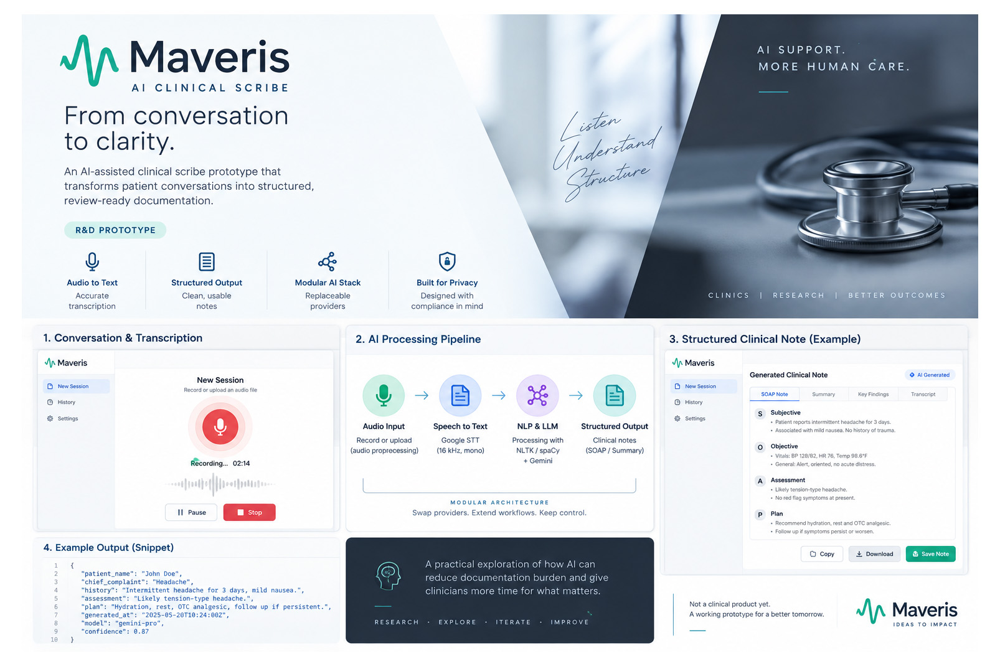

# Maveris — AI Clinical Scribe R&D Prototype

> **Research & development prototype**  
> Maveris explored a speech-to-text → language-processing → LLM pipeline for structured clinical documentation. It was not deployed as a production clinical system and no claim of HIPAA compliance, medical-device status, or clinical validation is made.

## Overview

Maveris was an early exploration into AI-assisted clinical documentation.

The central question was straightforward:

> Can a conversation recording be converted into a usable structured documentation draft through a lightweight speech and LLM pipeline?

The prototype focused on the technical workflow rather than building a complete healthcare product.

It combined audio preprocessing, speech recognition, transcript processing, and LLM-assisted summarization behind a simple application layer.

---

## Concept UI

The following visual explores how the Maveris workflow could be presented as a more complete product interface.

It illustrates recording/transcription, the AI processing pipeline, and structured clinical output.

> This is a concept visualization created for the R&D case study. It is not a screenshot of a deployed or production clinical system.



## Problem Being Explored

Clinical documentation workflows involve converting large amounts of spoken information into structured written records.

From a technology perspective, this creates several distinct problems:

- Capturing usable audio
- Normalizing audio for speech recognition
- Converting speech into text
- Cleaning and processing transcripts
- Extracting relevant information
- Converting unstructured conversation into structured documentation
- Preserving important context
- Avoiding unsupported additions by the language model
- Maintaining an auditable path from source conversation to generated output

Maveris was built to explore this pipeline end to end.

---

## Prototype Goal

The prototype was intentionally narrow.

```text
Recorded Audio
      ↓
Audio Normalization
      ↓
Speech Recognition
      ↓
Raw Transcript
      ↓
Text Processing
      ↓
LLM Processing
      ↓
Structured Draft
      ↓
Human Review
```

The objective was not autonomous medical documentation.

The objective was to determine whether the individual components could be connected into a practical AI-assisted workflow.

---

## My Role

My involvement covered:

- Product concept
- Workflow design
- Prototype architecture
- Python backend development
- Speech-to-text integration
- LLM integration
- Transcript-processing experiments
- Audio preprocessing
- Prompt and output-structure experimentation
- Local testing
- Evaluation of a potential B2B integration model

The project was primarily an R&D exercise in combining existing AI capabilities into a usable application workflow.

---

## What Was Prototyped

### Audio Processing

Incoming audio needed to be converted into a predictable format before transcription.

The prototype experimented with audio normalization toward a speech-recognition-friendly format, including:

```text
16 kHz
Mono audio
Consistent encoding
```

This created a defined input boundary between recorded media and the speech-recognition component.

---

### Speech-to-Text

Google Speech-to-Text was used during prototype development to convert normalized audio into text.

Conceptually:

```text
Audio File
    ↓
Audio Conversion
    ↓
Speech Recognition API
    ↓
Raw Transcript
```

Speech recognition was treated as one component of the pipeline rather than the complete solution.

A transcript still required downstream interpretation and structuring.

---

### Transcript Processing

The prototype explored conventional NLP tooling alongside LLM processing.

Experiments included technologies such as:

- NLTK
- spaCy
- Text normalization
- Sentence processing
- Transcript cleanup

The purpose was to determine which processing steps were useful before sending text into an LLM workflow.

---

### LLM-Assisted Structuring

Gemini was used experimentally to transform transcript content into a more structured summary.

The conceptual flow was:

```text
Transcript
    ↓
Prompt + Output Instructions
    ↓
LLM
    ↓
Structured Draft
```

The LLM was considered a drafting component rather than an authoritative source.

Any clinical implementation would require human review and substantially stronger validation, privacy, security, and governance controls.

---

## Prototype Architecture


The architecture was deliberately simple so individual components could be replaced during experimentation.

For example:

```text
Speech Provider A
        ↓
   Transcript
        ↓
      Maveris
        ↓
       LLM A
```

could potentially become:

```text
Speech Provider B
        ↓
   Transcript
        ↓
      Maveris
        ↓
       LLM B
```

without redesigning the complete workflow.

---

## Prototype Stack

### Application Layer

- Python
- Flask

### Speech Processing

- Google Speech-to-Text
- Audio conversion / normalization
- 16 kHz mono processing

### NLP Experiments

- NLTK
- spaCy

### Language Model

- Gemini

### Development Model

- Local prototype
- API-based AI services
- Modular processing pipeline

---

## Design Principle: Pipeline Over Model

One of the useful lessons from Maveris was that an AI application is rarely just an LLM call.

The actual product problem exists around the model.

```text
INPUT
  ↓
Validation
  ↓
Preprocessing
  ↓
AI Service
  ↓
Transformation
  ↓
Validation
  ↓
Human Interaction
  ↓
OUTPUT
```

For clinical documentation, the quality of the final output depends on every stage:

```text
Audio Quality
     ×
Transcription Quality
     ×
Context Preservation
     ×
Prompt Quality
     ×
Model Behaviour
     ×
Review Process
```

Improving only the final model does not solve weaknesses elsewhere in the system.

---

## Key Engineering Considerations

### 1. Speech Recognition Is Not Ground Truth

Automatic transcription can introduce:

- Missing words
- Incorrect terminology
- Speaker confusion
- Punctuation errors
- Errors caused by poor audio

Any downstream LLM receives those errors as input.

This makes transcription quality part of the reliability problem.

---

### 2. LLM Output Requires Validation

A language model may produce fluent text that is not fully supported by the source transcript.

For a sensitive domain, generated output therefore needs a clear relationship to source information.

A production-grade system would need mechanisms such as:

```text
Source Transcript
        ↓
Information Extraction
        ↓
Generated Documentation
        ↓
Validation
        ↓
Human Approval
```

rather than treating generation as the final step.

---

### 3. Structured Output Matters

Free-form summaries are easy to generate but difficult to integrate into operational workflows.

A more useful AI system should generate output according to a defined schema.

Conceptually:

```json
{
  "chief_complaint": "...",
  "history": "...",
  "observations": "...",
  "assessment_draft": "...",
  "follow_up": "..."
}
```

The example above illustrates the architectural idea only and is not presented as a clinically validated documentation schema.

---

### 4. Components Should Be Replaceable

Speech recognition and language models evolve quickly.

Hard-coding an application around one provider creates unnecessary dependency.

The architecture therefore benefits from conceptual boundaries such as:

```text
Audio
  ↓
Speech Adapter
  ↓
Canonical Transcript
  ↓
Processing Layer
  ↓
LLM Adapter
  ↓
Canonical Output
```

This makes experimentation and provider replacement easier.

---

### 5. Human Review Is Part of the System

For sensitive workflows, human review should not be treated as a temporary inconvenience that disappears once AI becomes sufficiently capable.

It is part of the operational architecture.

```text
AI generates
     ↓
Human verifies
     ↓
Human modifies if required
     ↓
Human approves
```

This creates a different product than an autonomous document generator.

---

## Product Direction Explored

One potential direction considered during the research phase was a **B2B integration model** rather than directly operating as a healthcare provider-facing platform.

Conceptually:

```text
Existing Scribing / Healthcare Platform
                ↓
           Maveris API
                ↓
     Speech + AI Processing
                ↓
        Structured Output
                ↓
Existing Platform Review Workflow
```

The reasoning was that established healthcare technology companies may already own important layers such as:

- User management
- Clinical workflows
- Customer relationships
- Compliance infrastructure
- Review processes
- Electronic health record integration

An AI processing layer could potentially focus on narrower capabilities rather than rebuilding the entire healthcare software stack.

This remained a product hypothesis and was not taken to commercial deployment.

---

## What Was Not Built

Maveris should not be interpreted as a finished clinical product.

The prototype did **not** establish:

- Production healthcare deployment
- HIPAA compliance
- Clinical validation
- EHR integration
- Production authentication architecture
- Production audit logging
- Healthcare organization onboarding
- Formal data-retention controls
- Medical-device certification
- Automated clinical decision making
- Commercial adoption

Those are materially different problems from demonstrating an AI processing pipeline.

---

## What Productionization Would Require

Moving from prototype to production would require significantly more than improving the model.

A production architecture would need to address areas including:

### Security & Privacy

- Encryption in transit and at rest
- Identity and access management
- Tenant isolation
- Secure secret management
- Data-retention policies
- Audit logging
- Consent handling
- Data deletion workflows

### AI Reliability

- Output schemas
- Source attribution
- Hallucination controls
- Confidence handling
- Model evaluation
- Regression testing
- Prompt versioning
- Human review

### Platform Engineering

- Queue-based processing
- Retry handling
- Background jobs
- Observability
- Error monitoring
- Provider failover
- API versioning
- Scalable storage

### Healthcare Integration

- Clinical workflow validation
- Terminology handling
- EHR interoperability
- Compliance review
- Organization-specific workflows

The distance between an AI prototype and a dependable healthcare system is therefore substantial.

---

## What I Learned

Maveris influenced how I think about later AI products.

The most important lesson was:

> **The model is a component. The workflow is the product.**

A useful AI system requires more than choosing a capable model.

It requires understanding:

- What enters the system
- Where errors can be introduced
- What context the model receives
- What the model is permitted to produce
- How outputs are validated
- What happens when a service fails
- Where humans remain in control
- How the resulting information enters an actual workflow

This systems perspective became more important to me than treating AI as a standalone feature.

---

## Current Status

**R&D / prototype — not in active production.**

The project is retained as a technical case study because it represents an early exploration of integrating speech recognition, NLP, and LLMs into a domain-specific workflow.

Maveris may be revisited if there is a sufficiently clear integration opportunity or narrow problem where the technical approach creates measurable operational value.

---

## Repository Purpose

This public repository documents:

- The original problem
- Prototype architecture
- AI workflow design
- Engineering considerations
- Product assumptions
- Limitations
- Lessons from the experiment

It does not contain private healthcare information, production credentials, proprietary customer systems, or claims of production clinical use.
